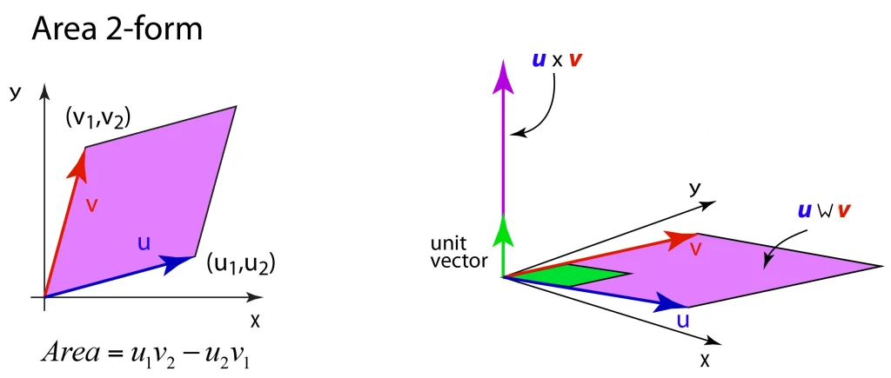

<!-- Convenience snippet (copy somewhere handy for search/replace):

-->

<!-- inserted helper CSS for the inline SVG wedge -->

Modified from the original at https://galileo-unbound.blog/2019/12/02/hermann-grassmanns-nimble-wedge-product/?utm_source=chatgpt.com

# Exterior Algebra

Exterior algebra begins with the definition of an operation on elements.
The elements, for example $u, v, w, x, y, z,$ etc., are drawn from a vector space in its most abstract form as “tuples”, such that

$$
x = [x_1, x_2, x_3, \dots, x_n]
$$

in an $n$-dimensional space. On these elements there is an operation called the **wedge product**, the **exterior product**, or the **Grassmann product**.
It is denoted, for example between two elements $x$ and $y$, as

$x$  $y$

It captures the sense of orientation through anti-commutativity, such that

$x$  $y$
= - $y$  $x$

As simple as this definition is, it sets up virtually all later manipulations of vectors and their combinations.
For instance, we can immediately prove (try it yourself) that the wedge product of a vector element with itself equals zero:

$x$  $x$ = 0

Once the elements of the vector space have been defined, it is possible to define “forms” on the vector space.
For instance, a 1-form, also known as a vector, is any function

$$
\alpha = a x + b y + c z
$$

where $a, b, c$ are scalar coefficients.
The wedge product of two 1-forms

$$\alpha = a x + b y + c z$$
$$\beta = d x + e y + f z$$

is

$\alpha$  $\beta$ = ($a x + b y + c z$)  ($d x + e y + f z$)

Expanding yields

$\alpha$  $\beta$
= ($a x + b y + c z$)  ($d x + e y + f z$)
= $ae\,$ $x$  $y$ + $af\,$ $x$  $z$ + $bd\,$ $y$  $x$ + $bf\,$ $y$  $z$ + $cd\,$ $z$  $x$ + $ce\,$ $z$  $y$.

Using anti-commutativity ( $y$  $x$ = - $x$  $y$, etc.) and collecting terms gives

α  β = (ae − bd) x  y + (af − cd) x  z + (bf − ce) y  z

which is a bivector (a 2-form). This is directly analogous to the cross product in 3-space, where $u\times v$ corresponds (up to the Hodge dual) to $u$  $v$.

The basis 2-forms are

$x$  $y$, $y$  $z$, $z$  $x$.

Many familiar vector identities in 3-space can be expressed in terms of exterior products, but the wedge product is more general.
For instance, while the triple vector cross product is not associative, the wedge product is associative:

$($ $u$  $v$ $)$  $w$ = $u$  ($v$  $w$).

This property makes it especially convenient for algebra on general \(r\)-forms.

Expressing the wedge product in terms of vector components, in 3-space one can write

($u$  $v$)$_i$ = $\sum_{j,k}\epsilon_{ijk}\,u_j\,v_k$,

where \(\epsilon_{ijk}\) is the Levi–Civita symbol. More generally, for $\omega_1$ a $p$-form and $\omega_2$ a $q$-form,

($\omega_1$  $\omega_2$)$_{i_1\ldots i_p j_1\ldots j_q}$
= $\omega_{1,i_1\ldots i_p}\,\omega_{2,j_1\ldots j_q}$,

antisymmetrized over all indices.

A 3-form is constructed as the wedge product of three vectors, for example $u$  $v$  $w$. In components (3-space) the scalar coefficient of the volume form $x$  $y$  $z$ is given by the triple product

$u$  $v$  $w$ = $\epsilon_{ijk}\,u_i\,v_j\,w_k$ ( $x$  $y$  $z$ ).

In 3-space there can be no 4-form, because one basis element would be repeated, making the product zero.
Thus the most general multilinear form (the exterior algebra) for 3-space is

$$
\Lambda^0 \oplus \Lambda^1 \oplus \Lambda^2 \oplus \Lambda^3,
$$

with \(2^3 = 8\) basis elements: one scalar, three 1-forms, three 2-forms, and one 3-form.
In \(n\)-space there are \(2^n\) elements in the full exterior algebra.

This rich multilinear structure all stems from the simple anti-commutativity

$x$  $y$ = - $y$  $x$.

Geometric interpretation

In Euclidean space, wedge products relate to oriented areas and volumes. A 2-form represents an oriented area element, and a 3-form an oriented volume. The magnitude of

$u$  $v$  $w$

corresponds to the volume of the parallelepiped spanned by \(u\), \(v\), and \(w\).

The wedge product is not limited to 3 dimensions nor to Euclidean spaces. It extends naturally to differential geometry, producing differential forms — the key objects for integration on manifolds and for the generalized Stokes' theorem.
